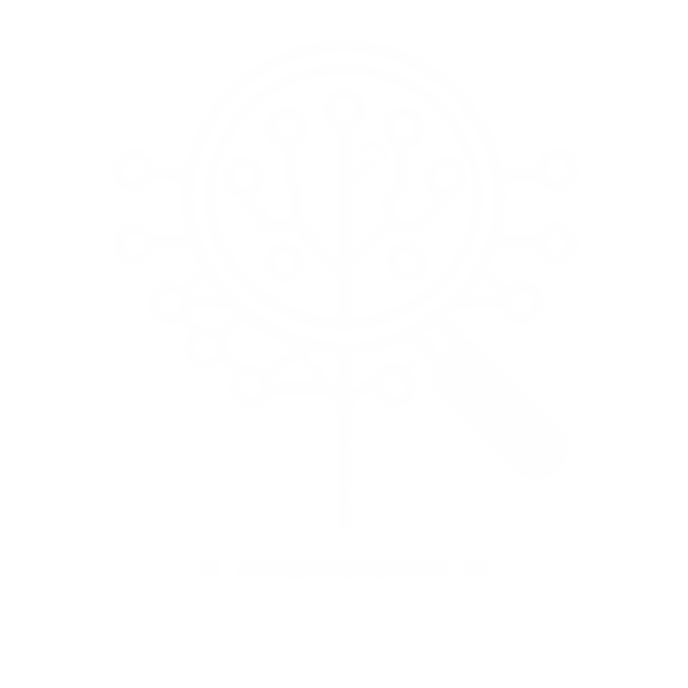
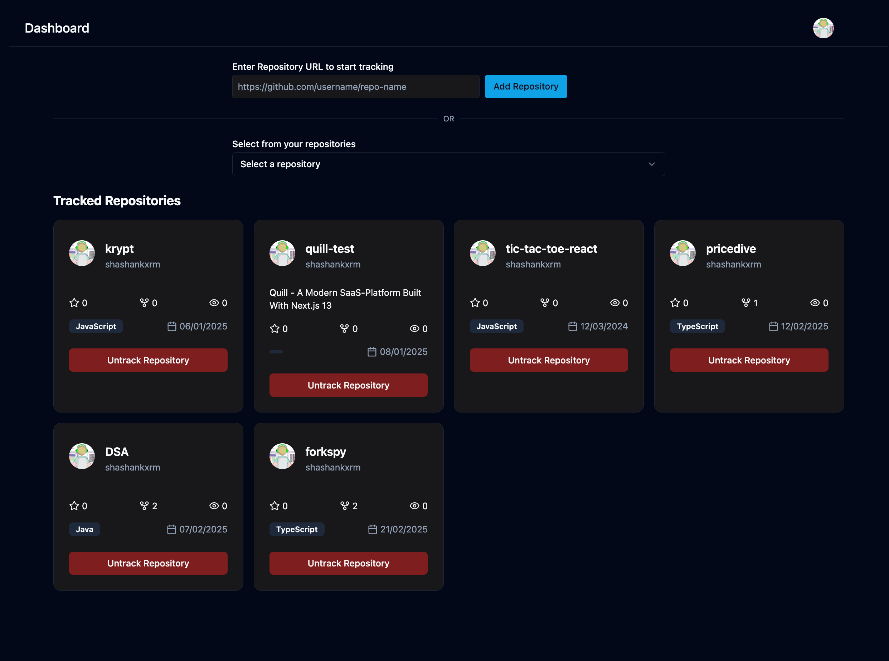

<!-- PROJECT LOGO -->
<br />
<div align="center">
  <a href="https://github.com/othneildrew/Best-README-Template">
    
  </a>

  <h1 align="center">ForkSpy</h1>

  <p align="center">
  <p>A Github fork tracking tool.</p>
    <br />
    <a href="https://github.com/shashankxrm/forkspy/README.md"><strong>Explore the docs »</strong></a>
    <br />
    <br />
    <a href="#">View Demo</a>
    &middot;
    <a href="mailto:shashankreddy0608@gmail.com">Report Bug</a>
    &middot;
    <a href="mailto:shashankreddy0608@gmail.com">Request Feature</a>
    <br />
    <br />
    
    
    
    
  </p>
</div>


<!-- TABLE OF CONTENTS -->
<details>
  <summary>Table of Contents</summary>
  <ol>
    <li>
      <a href="#about-the-project">About The Project</a>
      <ul>
        <li><a href="#built-with">Built With</a></li>
      </ul>
    </li>
    <li>
      <a href="#getting-started">Getting Started</a>
    </li>
    <li><a href="#usage">Usage</a></li>
    <li><a href="#testing">Testing</a></li>
    <li><a href="#docker">Docker Development</a></li>
    <li><a href="#contributing">Contributing</a></li>
    <li><a href="#contact">Contact</a></li>
  </ol>
</details>


<!-- ABOUT THE PROJECT -->
## About The Project



ForkSpy is a GitHub repository tracking tool that notifies users when their tracked repositories are forked. It helps developers stay informed about their project's reach and impact by providing real-time email notifications whenever a fork occurs.

Here's why you should use forkspy:
* Stay Informed Instantly – Get real-time email notifications whenever someone forks your repository. No more manually checking GitHub!
* See how your open-source work spreads and attracts contributors. Identify which projects are gaining traction.
* Simply sign in with GitHub, select the repositories you want to track, and let ForkSpy handle the rest.
*  Engage with developers who fork your project and encourage contributions to improve your codebase.

### Built With

* NextJS
* TailwindCSS
* OAuth
* TypeScript
* ShadCN
* MongoDB
* ReactIcons


<!-- GETTING STARTED -->
## Getting Started

This is an example of how you may give instructions on setting up your project locally.
To get a local copy follow these simple example steps.


<!-- USAGE EXAMPLES -->
## Use Cases

🚀 Open Source Project Growth – Track forks to measure your project's popularity and identify contributors who might collaborate.

📢 Community Engagement – Get notified when someone forks your repo and reach out to them for discussions, PRs, or feedback.

💼 Portfolio Monitoring – Keep an eye on how your personal or professional projects are spreading across the GitHub ecosystem.

👨‍💻 Team & Organization Insights – Companies and teams can monitor which repositories are being forked the most to prioritize development efforts.

📊 Trend Analysis – Identify which types of projects gain traction and adjust your development focus accordingly.


<!-- TESTING -->
## Testing

ForkSpy has a comprehensive test suite using Vitest for unit testing and React Testing Library for component testing. Tests cover:

* Utility functions
* Custom hooks
* API routes
* Component behavior
* Error handling

### Running Tests Locally

```bash
# Install dependencies
npm install

# Run tests once
npm run test

# Run tests in watch mode
npm run test:watch

# Run tests with coverage
npm run test:coverage

# Run tests with UI
npm run test:ui
```

### CI/CD

We use GitHub Actions for continuous integration. Every pull request and push to the main branch triggers:

1. **Test Suite** - All unit and integration tests
2. **Linting** - Code quality checks with ESLint
3. **Build** - Application build verification
4. **Coverage** - Test coverage reporting

The CI/CD badge at the top of this README shows the current pipeline status for the main branch.

To see detailed test reports and coverage, check the "Actions" tab in the GitHub repository.


<!-- DOCKER -->
## Docker Development & Production

ForkSpy provides complete Docker integration across three phases:

**✅ Phase 1 - Development**: Local development environment with hot reloading  
**✅ Phase 2 - Testing**: Dockerized test execution with full coverage validation  
**✅ Phase 3 - Production**: Enterprise-grade production deployment with security hardening  

### Prerequisites

- Docker Desktop (recommended) or Docker Engine
- Docker Compose v2.0+

### Phase 1: Development Environment

Perfect for local development with hot reloading and live code changes.

```bash
# Clone and setup
git clone https://github.com/shashankxrm/forkspy.git
cd forkspy

# Set up environment variables
cp .env.local .env
# Edit .env with your actual values (GitHub OAuth, MongoDB, etc.)

# Start development environment
npm run docker:dev

# Access application at http://localhost:3000
```

**Development Features:**
- 🔄 Hot reloading for instant code changes
- 📁 Volume mounting for live file synchronization  
- 🔧 Environment variable integration
- 🌐 MongoDB Atlas connection (no local database needed)

### Phase 2: Testing Environment

Validate your application with comprehensive test execution in Docker.

```bash
# Run full test suite in Docker
npm run docker:test

# Test results include:
# ✅ 21/21 tests passing
# ✅ 80%+ code coverage
# ✅ TypeScript compliance
# ✅ Build verification
```

**Testing Features:**
- 🧪 Complete test suite execution (Unit + Integration)
- 📊 Coverage reporting with detailed metrics
- 🔍 ESLint code quality validation
- 🚀 Build process verification

### Phase 3: Production Deployment ⭐

Enterprise-ready production environment with security hardening and monitoring.

```bash
# Build production image
docker-compose build

# Start production environment
docker-compose up -d

# Verify deployment
docker-compose ps
curl http://localhost:3000/api/health
```

**Production Features:**
- 🛡️ **Security Hardened**: Non-root user execution, Alpine Linux base (126MB)
- 📊 **Health Monitoring**: Built-in health checks with system metrics
- 🚀 **Performance Optimized**: Multi-stage builds, resource limits (512MB)
- 📈 **Production Ready**: Memory: 117.7MB (22.99%), CPU: 0.00% idle
- 🔍 **Enterprise Monitoring**: Health endpoint `/api/health` with comprehensive metrics

#### Production Health Check
```json
{
  "status": "healthy",
  "service": "forkspy",
  "version": "0.1.0", 
  "environment": "production",
  "uptime": "5 minutes",
  "memory": {"used": "117.7MB", "total": "512MB"},
  "timestamp": "2025-08-03T03:35:40.720Z"
}
```

### Docker Commands Reference

```bash
# Development
npm run docker:dev              # Start development environment
npm run docker:dev:build        # Build development image
npm run docker:stop             # Stop all containers

# Testing  
npm run docker:test             # Run test suite in Docker
npm run docker:test:coverage    # Run tests with coverage

# Production
docker-compose build            # Build production image
docker-compose up -d            # Start production (detached)
docker-compose ps               # Check container status
docker-compose logs app         # View application logs
docker stats forkspy-app-prod   # Monitor resource usage
```

### Production Deployment Ready

**Cloud Platform Compatibility:**
- ☁️ **AWS**: ECS, Fargate, EKS deployment ready
- ☁️ **Google Cloud**: Cloud Run, GKE deployment ready
- ☁️ **Azure**: Container Instances, AKS deployment ready  
- ☁️ **Kubernetes**: Full K8s compatibility with health checks

**Enterprise Features:**
- 🔒 Security hardening with non-root execution
- 📊 Resource monitoring and health checks
- 🚀 Horizontal scaling readiness
- 🔄 Zero-downtime deployment support
- 📈 Production metrics and logging

### Troubleshooting

If you encounter issues:

1. **Port conflicts**: Make sure port 3000 is not in use by other applications
2. **Environment variables**: Ensure your `.env` file has all required variables
3. **Docker daemon**: Make sure Docker Desktop is running
4. **Clean rebuild**: Run `docker-compose build --no-cache` to rebuild from scratch
5. **Production health**: Check `curl http://localhost:3000/api/health` for detailed status

For detailed Docker documentation and advanced configurations, see [project.md](./project.md#-docker-production-setup-phase-3-complete).


<!-- CONTRIBUTING -->
## Contributing

Contributions are what make the open source community such an amazing place to learn, inspire, and create. Any contributions you make are **greatly appreciated**.

If you have a suggestion that would make this better, please fork the repo and create a pull request. You can also simply open an issue with the tag "enhancement".
Don't forget to give the project a star! Thanks again!

1. Fork the Project
2. Create your Feature Branch (`git checkout -b feature/AmazingFeature`)
3. Commit your Changes (`git commit -m 'Add some AmazingFeature'`)
4. Push to the Branch (`git push origin feature/AmazingFeature`)
5. Open a Pull Request


<!-- CONTACT -->
## Contact

LinkedIn: [Shashank Reddy](https://www.linkedin.com/in/shashankxrm)
Mail:[shashankreddy0608@gmail.com](mailto:shashankreddy0608@gmail.com)

Project Live Link: [https://forkspy.vercel.app](https://forkspy.vercel.app)


